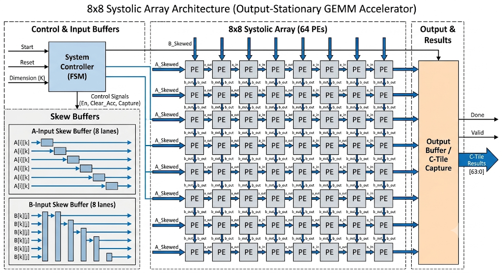
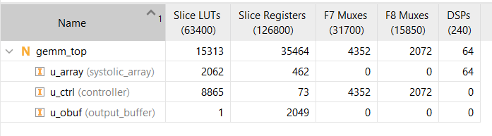

# 8x8 INT8 Systolic-Array GEMM Accelerator

This repository implements a cycle-accurate, output-stationary systolic-array hardware accelerator for tiled integer Matrix Multiplication (GEMM). Designed in SystemVerilog, the architecture computes highly parallel matrix operations using continuous data wavefronts, verified against a software golden model and synthesized for physical FPGA deployment.



## Overview & Key Architecture
The core compute fabric is an 8x8 grid of Processing Elements (PEs). The design utilizes an **Output-Stationary** dataflow, meaning intermediate accumulation stays local to each PE while input matrices flow through the array.

*   **Precision Math:** Inputs `A` and `B` are signed Int8 (-128 to 127). To prevent overflow during deep tile accumulation, products are immediately accumulated into signed Int32 registers.
*   **Wavefront Execution:** A dedicated Finite State Machine (FSM) controller streams 8x8 output tiles through the array. 
*   **Skew Buffers:** Hardware skew buffers strictly stagger the data injections, ensuring the correct `A` and `B` operands meet exactly on time at the correct PE.
*   **Synchronized Control:** Control signals (like the accumulator reset pulse) are fully pipelined and skewed alongside the data paths to guarantee perfectly synchronized execution without global fan-out bottlenecks.

## Synthesis & Implementation (PPA)
The design has been aggressively optimized for Xilinx FPGA architectures, proving its viability as a physical IP block. 

*   **Target Device:** Xilinx Artix-7 (Out-Of-Context Synthesis)
*   **DSP48E1 Slices:** 64 
*   **Slice LUTs:** 15,313
*   **Slice Registers:** 35,464



> **Hardware Engineering Note:** Synthesizing 8-bit math often triggers Vivado's area-optimization heuristics, causing the synthesizer to map MAC operations to standard Slice LUTs rather than DSP macros. To maximize timing performance and power efficiency, the Processing Elements in this design were structurally written to lock the multiplication and accumulation steps simultaneously within the sequential flip-flop boundary, forcing Vivado to perfectly map 100% of the compute logic to dedicated DSP48E1 MAC hardware.

## Verification Flow
The project utilizes a modern, software-driven verification approach to guarantee 100% cycle-level accuracy.
1.  **Python Golden Model:** A NumPy-based script generates randomized test matrices (e.g., 16x16), computes the exact matrix multiplication, and exports the arrays as hex files.
2.  **Verilator C++ Testbench:** A high-speed, cycle-accurate C++ simulation environment loads the hex files, drives the SystemVerilog accelerator pin-by-pin, extracts the final output tiles, and compares them against the golden vectors to ensure zero mismatches.

## Repository Structure
*   `rtl/` — SystemVerilog RTL (PE, Systolic Array, FSM Controller, Skew Buffers, Top-Level).
*   `tb/` — SystemVerilog testbenches (`tb_gemm_top.sv`, directed PE tests).
*   `sim/` — Makefiles and C++ wrappers to build and run Verilator simulations.
*   `verification/` — Python golden model and randomized test-vector generator.

## Quick Start

**1. Generate Golden Vectors**
Run the Python script to generate random matrices (Default M=16, N=16, K=16).
```bash
python3 verification/golden_model.py --M 16 --N 16 --K 16 --seed 1 --out sim
```

**2. Run Cycle-Accurate Simulation**
Build the C++ simulation environment and run the testbench (requires Verilator).

```bash
cd sim
make verilator
```
Note: A clean compilation will result in a ==== ALL TESTS PASSED ==== flag in the terminal with 0 mismatches across all output tiles.

Windows Users: A helper script is provided to regenerate vectors and run the full simulation cycle automatically:

```bash
./sim/run.ps1            # Regenerates vectors and runs Verilator
./sim/run.ps1 -M 32 -N 16 -K 24
```

## Notes
- The `verification/golden_model.py` script writes `a.hex`, `b.hex`, and
  `c_golden.hex` (two's-complement fixed-width hex) plus `dims.txt` into
  the `sim/` directory; the SystemVerilog TBs load those files via
  `$readmemh`.
- The preferred datapath width and array dimensions are defined in
  `rtl/sa_pkg.sv`.

## Next steps
- Run `tb/tb_pe.sv` first (directed single-PE tests), then `tb/tb_gemm_top.sv`.
- Read the Architecture & Skeleton Guide for detailed block diagrams and module contracts.
- Synthesize the design Out-Of-Context (OOC) in Vivado to verify DSP48E1 slice and LUT mapping on Xilinx Artix-7 FPGAs.

**Author**

Saswat Padhy

B.Tech in Electrical Engineering
